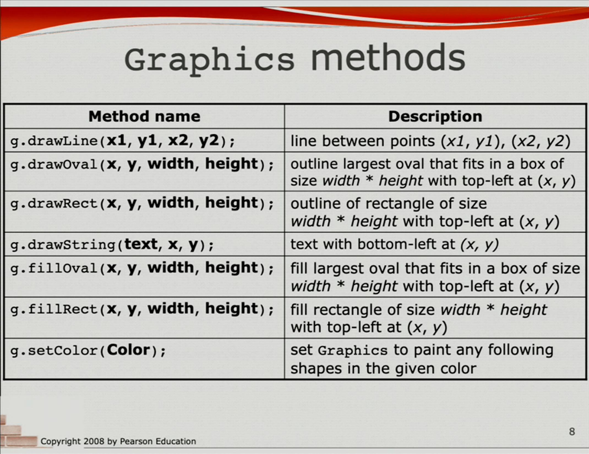

# Java Sketchbook
Uses DrawingPanel class written by [Stuart Reges and Marty Stepp](http://www.buildingjavaprograms.com/). I really hope I'm not breaking any fair use laws but if I am, please let me know before I'm expelled.

Download `DrawingPanel.java` and place it in the same folder as your `.java` file  
or just clone the repo and run your file from there.

Open your file in a Java IDE (e.g. jGrasp, BlueJ, etc.)

At the top of your code, write `import java.awt.*;`  

Here's an example to get started:  

```java
import java.awt.*;

public class Example {
  public static void main(String[] args) {
    DrawingPanel panel = new DrawingPanel(400, 400); // creates a 400x400 panel
    Graphics g = panel.getGraphics(); // get the Graphics component and pass into variable
                                      // so you can draw shapes
    
    panel.setBackground(Color.WHITE);
    g.setColor(Color.BLACK);
    g.fillRect(100, 100, 200, 100); // draw a BLACK 200x100 rectangle with top left at (100, 100)
  }
}
```

More advanced programming techniques (methods, loops, cool stuff) can greatly improve efficiency, appearance, and cool factor.

`Graphics` methods can be found [here](https://docs.oracle.com/javase/7/docs/api/java/awt/Graphics.html).

Alternatively, here's a screenshot of some basic methods:


